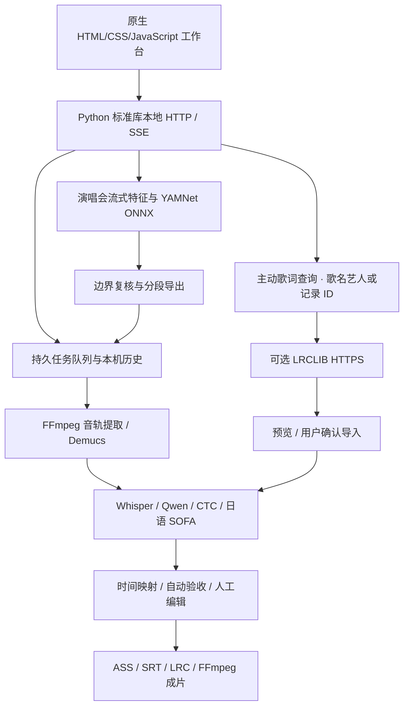

# 项目全面评估

评估更新日期：2026-10-02。范围为源代码、部署脚本、文档和测试；上一轮从干净的 `main@e680d9a` 开始复审并修复，本次补充工作台界面改进及可选 LRCLIB 歌词检索。下文保留早期评估结论，并记录确定性修复与新增能力。竞品信息见 [完整对照](COMPETITIVE_ANALYSIS.md)，最新执行结果见 [验证矩阵](VALIDATION.md)。

## 1. 总体判断

lets-karaoke 已经是可以完成实际制作任务的本地工具：它把长演唱会分段、已有歌词对齐、无歌词草稿、人工校正、字幕样式和视频导出串起来，拥有历史版本与诊断依据。最合适的成熟度描述是“有完整工作流的早期产品”。

本地运行描述的是媒体处理、模型推理和存储。新增歌词检索是可选外部依赖，主动搜索或预览时才请求 LRCLIB；模型及依赖下载也需要网络，不能把整个项目表述为所有功能完全离线。

算法主要来自已有开源模型，项目自己的价值是组合、现场问题修复、人工复核入口和 Windows 工作流。当前不能声称歌唱对齐准确率领先，也不能把每条候选边界当成识别出的歌曲。下一阶段应优先证明质量和减少人工处理时间。

## 2. 已完成的功能

| 环节 | 当前实现 | 使用边界 |
| --- | --- | --- |
| 输入 | 音频/视频、多文件/目录批量、逐文件歌词/语言/样式、独立音轨；TXT/LRC/增强 LRC/SRT | 每个字幕上传请求上限 3 GiB，媒体、歌词、独立音轨合计；演唱会用本机路径，可直接读取大文件 |
| 歌词检索 | 可选 LRCLIB 歌名/艺人搜索、按记录编号预览、纯文本/LRC 导入当前文件 | 无密钥；已有歌词确认替换、文件切换与过期响应保护；覆盖、版本和时间轴仍需核对 |
| 已有歌词 | 默认 Whisper/stable-ts；可选 Qwen ForcedAligner、Wav2Vec2；已具逐词时间的增强 LRC可直接渲染 | 选择框不等于实际后端：预对齐与增强时间轴会跳过后续声学模型 |
| 无歌词 | Qwen3-ASR 草稿后自动用 Whisper 二次对齐，保留草稿和诊断 | 转写可能漏词、错词、错分行，仍需校正文案 |
| 歌唱细化 | Whisper 行窗口 + SOFA 日语音素细化 | 当前 G2P 只支持日语；失败时使用行窗口近似，不能作为中文支持 |
| 声学辅助 | Demucs 人声/伴奏；混音与干声双路；能量、概率、后处理证据 | 人声分离会残留观众/伴奏，模型概率不是准确率 |
| 质量复核 | 缺行/重复句完整性、闪行、零宽、顺序/重叠、可疑句提示、有限重试 | 检查结构与风险；没有独立真值时不能判断全部歌词是否唱对位置 |
| 人工编辑 | 行起止、行/词偏移、歌词改字、漏句插入、多锚点分段重对齐、波形/循环试听 | 字内细分存在插值；暂存对齐与渲染视频是不同状态 |
| 样式 | 字体/大小/颜色/提前/余韵、1–3 行、逐行画面位置、选帧预览 | 没有成熟模板、合唱角色和片头片尾系统 |
| 输出 | ASS、SRT、增强 LRC/时间数据、字幕烧录 MP4；NVENC/x264 | SRT 不保留卡拉 OK 高亮；没有 CDG/MP3G 或 UltraStar 音高输出 |
| 演唱会 | 音量低谷/持续音色变化候选、YAMNet+WebRTC VAD 讲话提示、试听、拖界、吸附、拆分/合并 | 不识别歌名；串烧、曲内变化、MC/掌声仍需复核 |
| 演唱会交付 | 多分析版本、修订保护、快速 MKV/精确 MP4、批量/取消/部分恢复、一键进入字幕工作台 | 快速切割受关键帧影响；精确切割重新编码 |
| 任务与历史 | 后台持久队列、刷新恢复、排队重启恢复、运行中断重试、异步编辑取消、本机草稿和版本 | 字幕重试从任务重新运行，不是模型中间状态断点恢复 |
| 界面与操作 | 共享深色主题、青绿主操作/琥珀复核提示、步骤与工具分组、空状态、响应式、键盘焦点与减少动效 | 视觉层级改善不代表对齐质量提升；撤销/重做与版本差异仍待完善 |
| 部署与工程 | 五种依赖组合、模型下载/检查、可选虚拟环境、离线测试、Windows/Node CI配置、许可说明 | 第二台 Windows 已验证 Whisper/concert 部署；完整 Qwen/SOFA 干净安装仍待验证 |

## 3. 技术架构

| 层 | 技术与主要文件 | 工程判断 |
| --- | --- | --- |
| 前端 | 原生 JS、Canvas、HTML 媒体播放器；共享 `theme.css`、字幕样式及歌词检索模块；两个 iframe 工作台 | 构建依赖少、容易本地启动；状态与页面逻辑较集中，需要继续拆模块 |
| 服务 | Python 3.11、ThreadingHTTPServer、JSON API、SSE；`webui.py`/`concert_web.py` | 适合个人本机服务；没有账户、权限、多用户隔离，当前不适合直接作为公网产品 |
| 任务/保存 | 线程队列、锁、JSON持久化、原子替换、版本文件；`local_history.py` | 避免并发 GPU 与编辑覆盖；未来需要更清晰的任务/存储接口和事务边界 |
| AI | PyTorch 2.9.0/CUDA12.8、Transformers、Whisper+stable-ts、Qwen3-ASR-1.7B/ForcedAligner-0.6B、Wav2Vec2 CTC、SOFA/Lightning | 多路径可对照；模型各有适用域，未自行训练专用歌唱模型 |
| 语言 | 中文字、英文词、日文单元/字符映射；日文 G2P 使用 pykakasi | 已修混合文字/重复 token/长音映射；读音与音素到汉字归属仍有近似 |
| 媒体 | FFmpeg/FFprobe、libass、NVENC/x264、soundfile/librosa、NumPy/SciPy | 本地媒体能力完整；编码兼容与源视频预览仍有平台差异 |
| 演唱会 | 低采样率流式特征、频谱上下文、全局窗口 YAMNet/ONNX Runtime CPU、WebRTC VAD | 成本较低；没有专门训练/校准的歌曲边界模型 |
| 外部进程 | 取消/超时、Windows Job Object/pywin32；`process_runner.py` | 可回收 FFmpeg/Demucs/SOFA 进程树；原生 GPU 推理只能在调用边界取消 |
| 外部词库 | 标准库 HTTPS、固定 LRCLIB 来源、短期内存缓存、限频/超时/响应大小约束；`lyrics_search.py`/`lyrics_search.js` | 仅主动查询；搜索发送歌名/艺人，预览发送 ID，不附带媒体、路径或已有歌词；服务可用性与版本匹配受词库限制 |
| 评测 | unittest、Node 状态机、合成端到端、独立标注评分器 | 已有可重复基础；真实数据集和跨产品基准仍缺少 |

`webui.py`、`pipeline.py`、`index.html` 各有约一千五百到两千行，路由、模型预处理、保存与界面状态耦合较多。维护方向应是按任务、模型适配、媒体、存储和编辑状态拆分，而不是先更换整个技术栈。

## 4. 本轮查实并修复的缺陷

| 类别 | 修复前的确定性问题 | 当前处理 |
| --- | --- | --- |
| 文本/显示 | 重复 CTC 词聚合错归属、混合文字/日文长音遗漏、跨行 Whisper 配词错位、多行 SRT、LRC offset、时间进位 | 按出现位置保留归属；规范化精确映射；保留无法匹配的缺失证据；修解析与格式 |
| 时间 | 显示窗口为防重叠切掉演唱、SOFA裁音后仍按原句起点累加导致约200ms偏移 | 优先缩短提前/余韵，裁切纳入健康检查；SOFA使用实际采样裁音原点 |
| 资源/编码 | Qwen按语言重复缓存、渲染/分离取消慢、异常退出留下外部进程、编码器别名误入NVENC | 共享权重并加锁；统一进程树取消、超时、Windows回收；成片原子发布；规范编码器名称并提前拒绝未知值 |
| 页面任务 | SSE重复终态、断连无限等待、批量余项停留在网页、同步编辑、刷新丢进度/草稿 | 终态锁存、SSE+轮询、持久队列、异步编辑、原始ID/历史别名统一和草稿恢复 |
| 历史/HTTP | 活动记录可经别名删除、误删父目录、大文件整体读入内存、同名输入覆盖、Range/中文下载头、Windows拒绝请求偶发连接重置 | 按真实路径保护；删除先整体验证；流式上传、独立输入目录、统一文件服务；拒绝前限时消费小正文并验证同连接复用 |
| 演唱会版本 | 迁移并发、旧导出归属失效、不同版本调整相互覆盖、部分导出不可恢复 | 迁移锁/活动保护、明确 owner、版本/revision、逐片登记及继续导出 |
| 演唱会分析 | YAMNet批次时间漂移、持续音色变化漏切、阻塞解码无法及时取消 | 全局完整窗口、持续音色候选、可取消读取/超时、缓存与源指纹 |
| 安装/验证 | Python支持范围过宽、CUDA只看可见性、测试把生成成功当质量通过、零匹配测试可成功退出 | 已验证3.11组合与实际GPU运算；加入CPU/Node CI、歌词/结构/误差门槛、无匹配拒绝；远端状态见验证矩阵 |

这组修复提高确定性和可恢复性，没有因此获得真实歌唱准确率领先的证据。

### main 复审的 15 项修复

| 编号 | 查实的问题 | 修复与回归依据 |
| --- | --- | --- |
| 1 | 合并后的旧演唱会 ID 把 v1 写入错误版本 | ID 与版本一起映射，读取/保存/导出/重分析一致；真实 HTTP 与旧格式别名重载回归 |
| 2 | 排队任务取消后立即恢复执行两次 | 每次提交独立执行轮次，旧队列项失效；生成/异步编辑/删除及持久保存并发回归 |
| 3 | 增强 LRC 非零短词被自动拉长 | 采信时间时跳过塌缩扩展；完整管线检查 1–1.1 秒保持不变 |
| 4 | 行尾空时间标记丢失 | 下一时间标记关闭前词，显式结束优先；offset/重复行回归 |
| 5 | 忽略原时间使 Whisper/SOFA/ASR 新时间也被丢弃 | 后续渲染采纳预处理新时间，原请求保持可追溯；三路线检查没有第二次声学对齐 |
| 6 | 人工改字仍按原歌词误报遗漏 | 保存版本专属校验基准；父版本、旧编辑链、多轮草稿、真实漏句与重复句回归 |
| 7 | 静音视频无法搭配独立音轨 | 允许独立音轨供对齐/出片；真实 CPU 视频验证画面与音轨同时存在 |
| 8 | 忽略增强时间仍跳过所选人声分离 | 按实际是否采信逐词时间判断；验证分离调用及模型输入来自人声 |
| 9 | 演唱会迁移后根修订与最新版本不同 | 同步最新 revision/edited；默认视图后首次保存成功 |
| 10 | 成片重命名后中断使恢复永久失败 | 重命名前保存发布日志/完整 SHA，发布前后中断均无重编码恢复；每文件一次全读并拒绝改动 |
| 11 | 上传目录创建失败耗尽接收名额 | 初始化纳入清理保护；连续两次失败后第三次上传成功 |
| 12 | 全部歌词来源不可用仍可生成 | 集中管理能力与忙碌状态，按钮/直接提交都检查；9 项 Node 场景 |
| 13 | ASR/SOFA 探测漏掉 Whisper 依赖 | 包含全部 Whisper 前置模块；逐个缺依赖及完整可用环境回归 |
| 14 | 直接安装与启动使用不同 Python | 全部安装入口优先项目 `.venv`；隔离 Windows 的实际入口回归 |
| 15 | 已有有效 `.venv` 仍要求找到系统 3.11 | 先验证/复用已有环境，再查找新建解释器；隐藏系统解释器回归 |

当前本机 Python 3.11 回归 187/187、两套环境 GPU 合成各 8/8。旧草稿未记录改词意图时仍需重新应用修改；恢复不会把输出本身当作校验真值。

### 2026-10-02：工作台与可选歌词检索

- 字幕页、演唱会页和外壳共用主题变量，统一标题、卡片和主要操作；增加明确素材就绪与空预览提示、折叠说明、响应式布局、可见键盘焦点及减少动效支持。
- 可选 LRCLIB 查询无需密钥或注册。搜索与预览均由用户主动发起，仅发送填写的歌名/艺人名或所选词库记录编号，不附带媒体、本地媒体路径或已有歌词。
- 服务端固定使用 `https://lrclib.net`，保留 TLS 证书验证，不使用系统/环境代理、不跟随重定向、不接受自定义请求地址；输入、响应、超时、频率与缓存均设边界。
- 结果先预览再导入；导入仅更新当前文件，已有歌词确认替换，文件切换清除旧选择并阻止过期响应，处理中不允许导入。词库 LRC 通常只有行时间，逐字高亮仍需本地对齐。
- 同时修复本地歌词附件读取竞态：切换文件、清空、在线导入或手动编辑会使旧读取失效；编辑文本后不再附带旧歌词文件。本机 Python 3.11 回归 221/221，现有 3.13 环境 216 通过、5 项安装测试跳过；歌词查询和输入新增 37 项 Node 场景。

这些改进减少查找歌词和辨认操作入口的步骤，没有新增真实歌唱准确率证据。LRCLIB 的收录、演出版本与时间轴仍需核对；网络或服务不可用时，可继续本地粘贴/上传歌词或使用已安装 ASR。

## 5. 仍然遗漏或不足的部分

### 高优先级

1. **真实歌声真值与效果基准。** 已有标注格式、散列校验和评分器，尚缺足量、独立复核的现场样本。重复副歌、拖音、Rap、和声、长间奏、现场改词应分别统计。必须同时报告漏句、严重错位和人工修正时间。无歌词流程以ASR草稿作为输入完整性基准，不能检测ASR从未识别出的歌词，尤其需要人工校对。
2. **安装复现和维护。** 依赖有固定核心版本和范围，但没有完整依赖锁、模型修订清单及完整 Qwen/SOFA 干净安装报告。第二台 Windows 已通过 Whisper/concert 部署。stable-ts已归档/暂停开发，需要固定兼容范围、替换适配层及升级回归计划。
3. **取消与恢复的产品解释。** 模型调用期间不能即时抢占；字幕中断重试重新运行。窗口显示“已取消请求”与“已停止”应明确区分，避免用户误以为显存立刻释放。
4. **长期存储与失败治理。** 任务/草稿/版本会增长，仍缺磁盘预算、统一清理、缺源文件修复、整套可迁移项目包与诊断导出。多产物更新还不是单一事务。

### 中优先级

5. **编辑效率。** 本轮统一视觉层级并增加歌词查找入口；已有波形、锚点、循环和词偏移，但缺成熟的撤销/重做、字词拆分合并、版本差异对照、系统快捷键和批量文本编辑。词库结果还需核对现场改词、重复段和行时间，应实测修一首歌需要多少时间。
6. **预览兼容。** MKV、部分编码可被FFmpeg处理却不能在浏览器播放；当前提示错误，尚无自动预览代理。可增加临时低码率兼容预览与缓存管理。
7. **演唱会质量。** 没有真实边界 precision/recall 或容差指标；连续演奏/串烧、掌声与喊麦仍可能误切。YAMNet分类分数未校准，源指纹为抽样而非整文件散列。
8. **测试广度。** 当前本机回归 221/221，包含能力锁、安装、失败恢复及歌词查询/导入边界；远端实际结果见[验证矩阵](VALIDATION.md)。当前浏览器检查覆盖关键路径，未形成完整自动化浏览器矩阵；数小时视频、异常磁盘与多设备压力还需专项验证。
9. **工程边界。** GPU队列控制了并发，但缓存没有统一显存预算/释放策略；标准库服务和JSON目录适合单机，任务状态与存储格式仍应模块化、版本化。

### 按定位选择

10. **交付生态。** CDG/MP3G、合唱分角色、主题模板、片头片尾、音高评分、协作和发布集成都没有完整实现。不要同时扩展全部，应优先决定目标是现场字幕制作还是广义卡拉OK平台。
11. **发布许可。** 自有代码MIT不覆盖全部依赖：可选pykakasi为GPL，SOFA具体检查点和FFmpeg构建需分别核对。打包商业产品前需要实际构建的依赖/通知清单。

## 6. 验证证据与局限

本机确认 Windows 11、Python3.11.8、PyTorch/torchaudio2.9.0+cu128、RTX5090 D v2约24GiB可运行；模型与完整依赖检查通过。它证明当前机器可用，不代表所有Windows/NVIDIA环境。

本轮8个Qwen GPU合成端到端用例全部通过新门槛：完整行/词映射、结构健康、产物存在、token起点P90≤250ms；观察到最差约211.6ms。包括中文/英文/日文、TXT/LRC，以及中文/日文混音分离。该数据来自合成语音与构造伴奏，不能外推到真实歌唱。

离线回归包括真实FFmpeg、libass像素、HTTP上传/Range、持久恢复、Windows进程树回收，以及前端状态机。演唱会专用验证包括真实本地YAMNet整段/分批逐帧一致、取消后片段可下载、重载后继续导出、并发迁移及奇数画面尺寸。完整计数与最新执行记录以[验证矩阵](VALIDATION.md)为准。

浏览器实际验证了两项合成任务提交后刷新恢复、异步插入、后台草稿从历史别名恢复。未做真实现场精度的跨产品实验，也未拿个人素材当公开测试夹具。

## 7. 建议改进顺序

| 顺序 | 交付物 | 可验收的标准 |
| --- | --- | --- |
| 1 | 可靠发布基线 | 全新Windows按文档部署；队列/草稿/取消/版本路径通过；明确GPU与模型组合；CI无跳过关键检查 |
| 2 | 中文为主真实基准 | 有授权录音、固定散列、独立句/词标注、dev/test隔离；每个版本报告漏句、起止P90、严重错位 |
| 3 | 现场对齐改进 | 在固定基准比较Whisper单路/双路、Qwen、日语SOFA、重试策略；实际改善精度与人工修正分钟数 |
| 4 | 编辑与互操作 | 撤销/快捷键/波形缩放/版本差异、ASS与Aegisub、分段清单与LosslessCut交换、可移动工作包 |
| 5 | 长演唱会体验 | MC/连续演奏专项数据、兼容预览、源音轨选择、导出加速、磁盘与缓存治理 |
| 6 | 产品化 | 固定发布包、依赖许可清单、诊断与支持；据真实用户需求决定模板/合唱/商业功能 |

建议以“完成一场演唱会的人工时间、严重错位次数和失败恢复成本”为产品指标。无需先换模型或增加更多参数，先让已有能力可量化、可解释、可恢复。

## 8. 竞争力判断

开源完整制作对手是[karaoke-gen](https://github.com/nomadkaraoke/karaoke-gen)，商业直接参照是[PowerKaraoke AI Karaoke Video Creator](https://www.powerkaraoke.com/src/prod-ai-karaoke-video-creator.php)。两者也有本地AI和人工审阅，因此“本地、免费、无订阅”主要是选择理由，不能单独构成技术壁垒。

本项目最有希望的差异是：中文Windows用户从长演唱会分曲/MC复核，到保留舞台原画面的歌词对齐、可见证据、人工锚点和恢复流程，在同一个本地工作台完成。与成熟工具相比，模板/格式/安装及编辑效率仍有差距；现场质量优势有待同素材实测。

详细开源、商业、字幕编辑、云视频和分曲工具对照及来源见[竞品分析](COMPETITIVE_ANALYSIS.md)。
