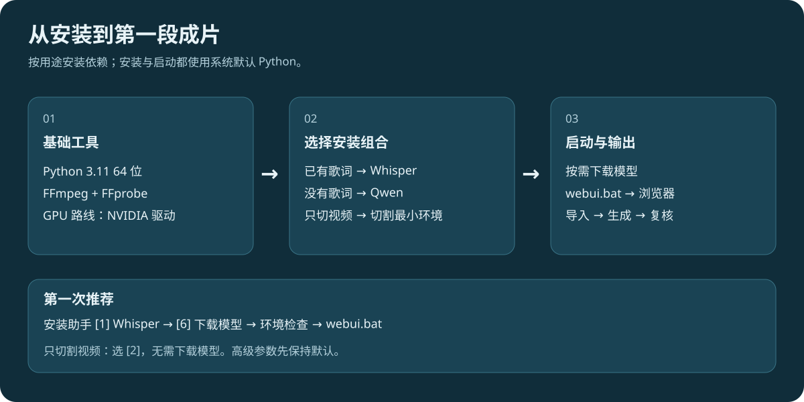
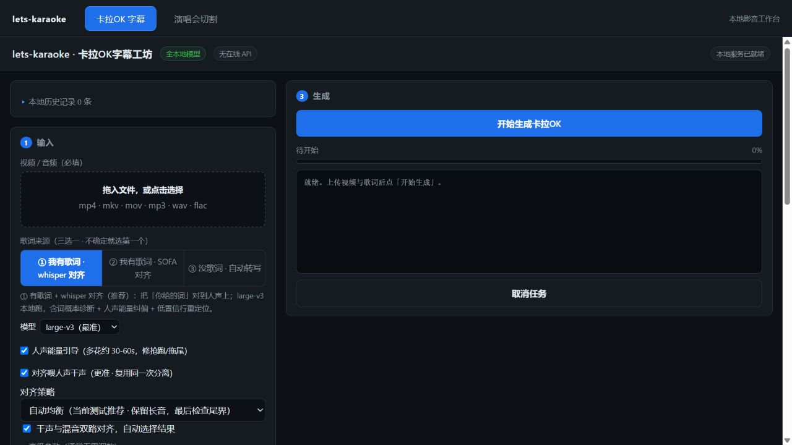
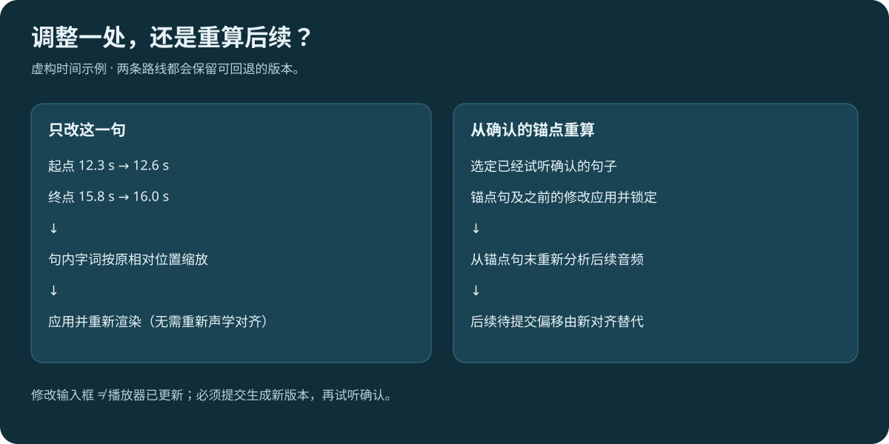
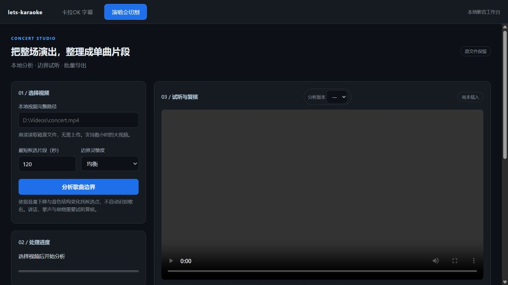
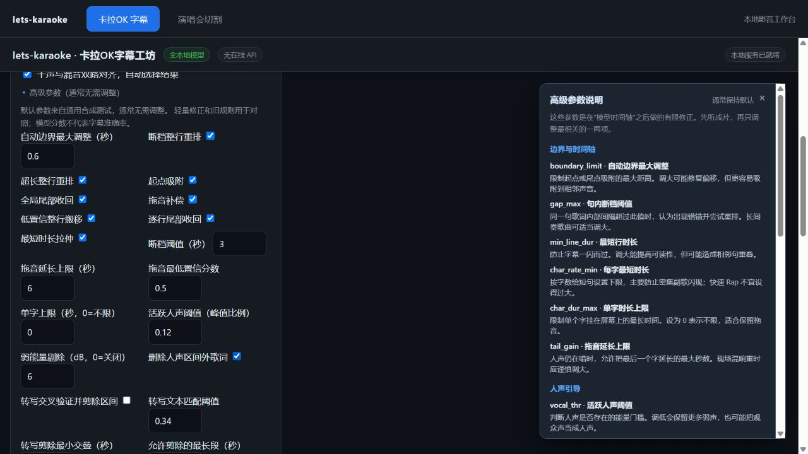

# lets-karaoke 图解使用手册

从下载安装到第一段成片，适合第一次使用本项目的 Windows 用户。

**最快上手路线：Python 3.11 → FFmpeg → 下载项目 → 安装 Whisper 依赖 → 下载 Whisper 模型 → 启动网页 → 导入媒体和歌词 → 生成与复核。**

本手册界面图来自无个人记录的页面；流程图使用虚构示例，不需要下载任何测试歌曲。

## 目录

- [1. 先选你要做的事](#1-先选你要做的事)
- [2. 准备电脑与基础工具](#2-准备电脑与基础工具)
- [3. 下载项目、安装依赖和模型](#3-下载项目安装依赖和模型)
- [4. 启动与关闭网页](#4-启动与关闭网页)
- [5. 第一段卡拉 OK 视频](#5-第一段卡拉-ok-视频)
- [6. 看懂对齐诊断](#6-看懂对齐诊断)
- [7. 纠错、锚点与插入歌词](#7-纠错锚点与插入歌词)
- [8. 历史与结果文件](#8-历史与结果文件)
- [9. 演唱会切割](#9-演唱会切割)
- [10. 参数怎么选](#10-参数怎么选)
- [11. 常见问题与维护](#11-常见问题与维护)

## 1. 先选你要做的事



| 你想做什么 | 安装助手选项 | 还需要准备 | 网页入口 |
| --- | --- | --- | --- |
| 已有歌词，生成逐字高亮字幕 | **1：Whisper**，新手推荐 | Whisper 模型、音频/视频、歌词 | ① 我有歌词 · whisper 对齐 |
| 只把整场视频切成片段 | **2：切割最小环境** | FFmpeg、视频；无需 GPU/模型 | 演唱会切割 |
| 没有歌词，先自动转写 | **3：Qwen** | Qwen ASR、ForcedAligner 和 Whisper 模型 | ③ 没歌词 · 自动转写 |
| 尝试歌声音素细化 | **4：SOFA** | Whisper 模型、SOFA checkpoint | ② 我有歌词 · SOFA 对齐 |
| 需要全部功能 | **5：完整环境** | 按实际功能下载模型 | 两个工作台 |

**安装依赖和下载模型是两件事。** 安装完成后，未下载模型的功能仍不能使用。安装助手中的“环境/profile”表示依赖组合：脚本直接安装到当前系统默认 `python`，不会创建虚拟环境，也不需要 ComfyUI。

## 2. 准备电脑与基础工具

### 2.1 系统与硬件

- 主要面向 Windows 11。第一次部署建议用 **Python 3.11 64 位**；脚本接受更高版本，但第三方模型库的兼容性需要另行确认。
- Whisper、Qwen、SOFA 安装组合按 NVIDIA GPU 路线配置。只切割演唱会不需要 GPU。
- 提前留出依赖、模型、原视频和输出视频的空间。不同模型占用不同，不把某个显存数当作全功能保证。
- 首次安装和下载模型需要网络；模型准备好后的媒体处理在本机进行。人声分离模型首次使用也可能需要下载。

### 2.2 安装 Python

1. 从 [Python 官方 Windows 下载页](https://www.python.org/downloads/windows/) 安装 Python 3.11 64 位。
2. 安装时勾选 **Add python.exe to PATH**。
3. 重新打开命令提示符，运行：

```bat
python --version
python -m pip --version
where python
```

应看到 Python 3.11.x，并且 `pip` 属于同一个 Python。电脑上有多个 Python 时，以 `where python` 的第一项和 `python --version` 为准。后面的所有安装和启动都要使用这个解释器。

### 2.3 安装 FFmpeg

1. 打开 [FFmpeg 官方下载页](https://ffmpeg.org/download.html)，选择其链接的 Windows 构建。
2. 解压到固定目录，把包含 `ffmpeg.exe` 和 `ffprobe.exe` 的 **bin 目录**加入用户环境变量 `Path`。
3. 关闭并重新打开命令提示符，检查：

```bat
ffmpeg -version
ffprobe -version
ffmpeg -filters | findstr subtitles
```

前两条应显示版本，第三条应找到 `subtitles` 滤镜。字幕烧录需要带 libass 的 FFmpeg 构建。

使用字幕 GPU 路线时，还应安装适配显卡的 [NVIDIA 驱动](https://www.nvidia.com/Download/index.aspx)，运行 `nvidia-smi` 应能显示显卡。通常无需单独安装整套 CUDA Toolkit；项目安装脚本使用配套 CUDA 的 PyTorch wheels。

## 3. 下载项目、安装依赖和模型

### 3.1 获取代码

**不熟悉 Git：** 打开 [项目仓库](https://github.com/LaHauzel/lets-karaoke)，点击 **Code → Download ZIP**，解压后进入包含 `webui.bat` 的目录。不要直接在压缩包中运行脚本。

**已安装 Git：** 在命令提示符运行：

```bat
git clone https://github.com/LaHauzel/lets-karaoke.git
cd lets-karaoke
```

以下命令都在项目根目录执行。新手可以在资源管理器打开项目文件夹，在地址栏输入 `cmd` 后回车。若使用 PowerShell，运行批处理时加 `.` 和反斜杠，例如 `./setup_guide.bat`。

### 3.2 推荐：先安装 Whisper

双击 `setup_guide.bat`，输入 **1** 并回车。它会检查 Python、安装所需依赖，再运行环境检查。

| 安装助手菜单 | 作用 |
| --- | --- |
| 1–5 | 按功能安装依赖；对应上一节的路线 |
| 6 | 下载 Whisper large-v3 模型，约 3 GB |
| 7 | 下载 Qwen：A 为 ForcedAligner，B 为 ASR，C 为两者 |
| 8 | 查看基础环境和模型状态；字幕路线仍建议运行下方专项检查 |
| 9 | 启动 WebUI |
| 10 | 打开安装排错文档 |
| Q | 退出安装助手 |

已有歌词：安装 **1** 后选择 **6**。等待下载完成，再运行：

```bat
python src\check_environment.py --profile whisper
```

检查中的 **FAIL** 要先解决；**WARN** 要看具体内容，若提示本路线所需模型缺失，先补下载。用检查结果判断是否就绪，不以菜单回到首页作为安装成功依据。

也可在命令提示符直接执行同一条路线：

```bat
setup_profile.bat whisper
python src\fetch_whisper.py --model large-v3
python src\check_environment.py --profile whisper
```

`setup.bat` 会安装完整环境，第一次只用 Whisper 时无需选它。GPU 安装脚本在检查失败时尝试安装 PyTorch 2.9.0 / torchaudio 2.9.0 / torchvision 0.24.0 的 CUDA 12.8 版本；已存在可用 CUDA PyTorch 时会复用。

### 3.3 其他路线

**只切割视频：** 选择 **2**，或运行：

```bat
setup_profile.bat concert
python src\check_environment.py --profile concert
```

**无歌词自动转写：** 选择 **3** 安装依赖，再用 **6** 下载 Whisper、**7 → C** 下载两种 Qwen 模型。ForcedAligner 约 1.8 GB，ASR 约 4.7 GB，具体以下载器为准。

```bat
setup_profile.bat qwen
python src\fetch_whisper.py --model large-v3
python src\fetch_models.py
python src\check_environment.py --profile qwen
```

**SOFA：** 选择 **4** 安装依赖，再下载 Whisper。SOFA checkpoint 需要从 [上游说明](../tools/SOFA/README_zh.MD) 指向的渠道按模型条款获取，并放在：

```text
models/sofa/multilingual/pretrained_multilingual_singing/v1.0.0_multilingual_singing.ckpt
```

再运行 `python src\check_environment.py --profile sofa`。若还没拿到 checkpoint，先用 Whisper 路线即可。

## 4. 启动与关闭网页

1. 双击 `webui.bat`，保留它打开的服务窗口。
2. 浏览器会打开 [http://127.0.0.1:7870/](http://127.0.0.1:7870/)。没有自动打开时手动访问即可。
3. 顶部有 **卡拉OK 字幕** 和 **演唱会切割** 两个标签，共用一个服务。
4. 用完后，在服务窗口按 **Ctrl+C** 停止服务。只关闭网页不会停止后台；处理期间停止服务会中断任务。



首次启动可能进行模型预热。只切割演唱会或想先打开页面时，可运行：

```bat
python src\webui.py --no-warmup
```

端口已占用时，先检查是否已经有服务在运行；需要改端口可执行 `python src\webui.py --port 8000`，然后访问 `http://127.0.0.1:8000/`。不要把同时开多个实例当成修复方式。

## 5. 第一段卡拉 OK 视频

### 5.1 输入媒体和歌词

1. 在 **1 输入 → 视频 / 音频** 拖入文件，或点击选择。
2. 有歌词选 **① 我有歌词 · whisper 对齐**。
3. 在歌词文本框粘贴歌词，或点 **选择歌词文件** 导入。首次推荐 UTF-8 TXT，一句一行；重复唱的句子也应按演唱顺序重复写出。
4. 有 LRC 时可直接提供时间标签。高级选项的“时间戳用法”默认吸附到时间戳；时间轴版本与音频不匹配时不要盲目信任。
5. 选择 **歌词语言**。已知主语言时主动选择；混合语言的结果需要试听。

下面是虚构的格式示例，**不对应任何测试歌曲**：

```text
把今天写成一段旋律
让明天接住新的声音
```

行级 LRC 写法：

```text
[00:05.00]把今天写成一段旋律
[00:09.50]让明天接住新的声音
```

模型会按你提供的文字定位，不能自动证明文本与演唱版本一致。先删除演出中未唱的段落、补上重复句，比盲目修改几十个高级参数更有效。

### 5.2 首次推荐配置

| 选项 | 建议 | 用途 |
| --- | --- | --- |
| 模型 | large-v3 | 默认路线；首次加载比后续运行慢 |
| 对齐策略 | 自动均衡 | 保留当前通用后处理默认值 |
| 人声能量引导 | 开启 | 依据人声活动修正部分边界 |
| 对齐喂人声干声 | 开启 | 用分离人声帮助模型定位 |
| 干声与混音双路对齐 | 开启 | 多跑一路，用模型证据选择结果 |
| 人声处理 | 首次选 **保留原唱** | 便于听着歌检查字幕；制作伴奏成片再选去除人声 |
| 独立音轨 | 留空 | 有意替换原音轨时才提供 |
| 高级参数 | 保持折叠 | 出现具体问题后再调整 |

“保留原唱”只决定输出音轨；人声引导/干声对齐开着时仍可能运行分离。不是选了保留原唱就一定跳过分离。

### 5.3 样式与生成

在 **2 字幕样式** 选字体、字号、颜色、预亮提前和余韵延后。先保持默认即可。日文可尝试“日文整单元高亮”，减少单元内部逐字插值造成的视觉误差；所选字体需已安装并支持歌词文字。

点击 **开始生成卡拉OK**。右侧显示阶段和日志；模型加载、首次分离、视频编码都可能耗时，不以短暂无进度变化判定卡死。

生成完成后出现成片播放器、下载项、诊断和 **4 人工微调对齐**。纯音频也可以生成带字幕的视频。先试听开头、换段和长音，再决定是否调整。

### 5.4 没有歌词时

选 **③ 没歌词 · 自动转写**。准备好 Qwen 依赖/模型后生成初稿；处理还会使用 Whisper 做二次对齐。先校正识别错字、漏句、重复句和分行，再把修正文字按“已有歌词”路线重新生成。显示 100% 覆盖不等于歌词识别正确。

## 6. 看懂对齐诊断

展开 **逐句对齐 · 依据与复核**，先筛选“重点复核”，再看“建议复核”。可搜索歌词或原行号；展开单句查看时间、置信度和风险依据，点试听跳到相关位置。详情可以收起，避免一次展示过多信息。

| 提示 | 实际含义 | 接下来做什么 |
| --- | --- | --- |
| 模型置信偏低 | 模型对该段词与声音的匹配证据较弱 | 听这一句；检查文本、起止和重复段 |
| 干声/混音边界分歧 | 两路模型给出的时间不一致 | 对照原唱判断在哪一路附近 |
| 后处理改变边界较多 | 最终时间与模型原始结果相差较大 | 优先检查是否移到了邻句 |
| 低人声能量区 | 高亮部分落在检测到的弱人声区域 | 检查是否拖尾、弱唱或分离误判 |
| 未输出歌词 | 输入句没有进入最终字幕 | 核实是否漏唱、错词或被规则删除 |
| 仅结构检查 / 声学依据不可用 | 当前版本没有完整模型诊断数据 | 不能把没有提示当作高置信 |
| 未触发提示 | 没有触发当前规则 | 仍可抽查，不代表人工验收完成 |

置信度是模型分数，结构健康检查的是重叠、逆序、零时长等问题，两者都不是准确率。旧记录或手动编辑后的诊断也可能不完整；“0 句有提示”要结合“有多少句有声学依据”一起看。

## 7. 纠错、锚点与插入歌词



### 7.1 播放到哪里，就找到哪句

点击成片播放器下面的 **定位当前播放歌词 ↓** 可定位对应歌词；勾选 **微调表自动跟随**，播放时表格跟随。表格每行的 **▶** 可以反过来把播放器跳到该句。复核时可选 0.75× 或 0.5× 试听速度。

### 7.2 只改这一句

在 **人工微调对齐** 表格中分别填 **起点（秒）** 和 **终点（秒）**，终点必须晚于起点。例如开始是 12.3 秒、结束是 15.8 秒，直接输入 `12.3`、`15.8`。

- 改起止时间会按原相对位置缩放句内字词时间。
- 整行偏移以毫秒计，会叠加在新起止时间上；1000 ms = 1 秒。
- 展开歌词可调整单个字词的偏移，偏移相对当前选中版本。
- 点击 **应用并重新渲染** 后播放器才显示新结果。未提交时，播放器仍播放旧视频。
- 这一步重做字幕和视频编码，不重新进行声学对齐。长视频仍可能花费较长时间。

### 7.3 从人工锚点开始，重算后续

当“前面已对、后面整体乱了”时：

1. 调整并试听确认一句歌词。
2. 展开 **人工锚点 · 重新对齐后续**。
3. 在 **已确认的锚点句** 选择它。
4. 点击 **锁定此句，重新对齐后续**。
5. 等模型与编码完成，检查新版本；有问题可切回旧版本。

它会应用锚点句及之前的待提交调整并锁定，从锚点句末重新分析其余音频。**后续句的待提交偏移会被新对齐替代**；它不是把后面所有歌词机械平移相同秒数。锚点应选在文本正确、句末容易听清的位置。

### 7.4 插入漏掉的新歌词

展开 **插入新的歌词**，选择插入位置、输入一整句，再选定位方式：

| 定位方式 | 怎么填 | 执行结果 |
| --- | --- | --- |
| 自动重新对齐 | 选插入点，填歌词 | 以前一句为锚点，重算新增句及后续 |
| 手动指定时间 | 另填起点和终点秒数 | 区间内均分字词时间，不等于模型精确逐字边界 |

点击 **插入并生成新版本**。插入前后都应检查相邻句是否重叠、是否把重复句插入了错误位置。

## 8. 历史与结果文件

展开 **本地历史记录** 可搜索、重新扫描、恢复已有记录。进入微调区后，通过 **查看 / 继续编辑版本** 切换历史版本；微调、锚点重算、插入歌词会生成可回退版本。

“重新扫描”用于识别输出目录内已有且可解析的记录，不是扫描整台电脑的任意视频。旧产物缺少元数据时，不一定能够恢复全部功能。

| 文件或目录 | 用途 |
| --- | --- |
| `out/webui/` | 字幕任务、生成视频、对齐数据及版本 |
| `.mp4` 成片 | 高亮字幕已烧进画面，可直接观看 |
| `.ass` | 保留字幕样式和卡拉 OK 高亮信息 |
| `.srt` | 普通字幕时间轴，不保留 ASS 高亮效果 |
| 增强 `.lrc` / 逐字时间数据 | 后续编辑、对齐或兼容工具使用；以结果下载项为准 |
| `out/concert/` | 切割分析记录、时间表和导出批次 |
| `models/` | 模型缓存，不是导出视频 |

优先使用结果区下载按钮；需要备份编辑历史时，保留完整任务目录，并保留对应源媒体。单独保留 MP4 可以观看，但不足以恢复全部编辑状态。

历史入口支持勾选后 **批量删除**、单条删除和 **清空历史**。这些操作会删除对应记录目录及其产物，不是简单隐藏列表；删除前备份需要的视频和版本。

## 9. 演唱会切割



1. 顶部切到 **演唱会切割**。
2. 输入本机视频的完整路径。可在资源管理器选中文件，使用“复制文件地址”；粘贴后去掉额外引号。
3. 新手先选 **均衡** 灵敏度，保留 **120 秒** 最短候选片段。短曲较多时适当降低；这个值是候选分析约束，不是固定切成两分钟。
4. 点击 **分析歌曲边界**，等待音量轴和候选表出现。
5. 点击音量轴定位，拖动蓝线调整边界；在播放位置拆分，或删除边界合并相邻片段。也可直接修改表格时间和名称。
6. 点击 **保存调整**，勾选需要导出的片段。
7. 选择导出方式并点 **导出选中片段**。

| 导出方式 | 文件 | 适合场景 | 注意 |
| --- | --- | --- | --- |
| 快速导出 | MKV | 快速拆分，不重新压缩 | 受关键帧限制，开头可能带上切点前画面 |
| 精确切割 | H.264/AAC MP4 | 希望切点更准确、便于通用播放器播放 | 会重新编码，更耗时 |

觉得切点太多，改“保守”；切点太少，试“灵敏”。已有记录可点击 **按当前灵敏度重新分析此记录** 生成另一个分析版本，之后再复核。

结果在 `out/concert/<任务编号>/export-<批次编号>/`。每批包含 `manifest.json`，记录/版本在 `concert.json`。取消导出保留已完成文件，尚未完成的片段会被清理。

这里依据音量和音色变化提出候选边界，不自动识别歌名。讲话、掌声、串烧、曲内停顿都可能误切；精确编码也不能代替边界试听。

## 10. 参数怎么选



展开 **高级参数（通常无需调整）** 时，说明小窗随之打开；折叠时自动关闭。先确定问题，再改一两项；可以点击 **恢复当前模式默认值** 撤回参数试验。

| 看到的问题 | 优先操作 |
| --- | --- |
| 个别句早了/晚了 | 先手动改这句起止；后面也乱时用锚点重算 |
| 长音提前结束 | 听清实际尾音，再考虑拖音补偿；不要只凭混响延长 |
| 句子持续到间奏 | 复核尾部收回、人声引导及歌词是否多写 |
| 重复副歌跑错位置 | 核对重复行顺序，以正确上一句作锚点 |
| 生成太慢 | 先试短片段或 medium/base；双路、分离会增加工作量 |
| 只想改字体颜色 | 改样式后重新渲染，通常不需要重跑对齐 |
| 默认值也报范围错误 | 恢复当前模式默认值并重新加载页面；仍失败时保留报错与版本提交 Issue |

高级对齐后端里的 Qwen/Wav2Vec2 主要用于相应声学后端流程；已有增强 LRC/预对齐时间轴时会直接复用，不能仅凭下拉框判断本次实际用了哪个模型。以日志的实际执行阶段为准。

## 11. 常见问题与维护

| 症状 | 排查办法 |
| --- | --- |
| `python` 无法识别，或打开商店 | 安装 Python 并加入 PATH；重新打开终端，用 `where python` 检查 |
| 安装到一个 Python，启动却缺库 | 使用同一个 `python -m pip`；核对安装和启动时的 `where python` |
| 找不到 FFmpeg/FFprobe | 把实际 bin 目录加入 PATH，重新开终端检查两个版本命令 |
| `No such filter: subtitles` | 改用带 libass/subtitles 的 FFmpeg 构建 |
| CUDA 不可用 | 检查 NVIDIA 驱动和 `nvidia-smi`；运行对应 profile 环境检查 |
| 显存不足 | 关闭其他占显存软件；已有歌词可试更小 Whisper 模型；不要并行跑多个任务 |
| 模型下载失败/找不到模型 | 重试相应下载命令，核对模型目录；不要用改扩展名代替真实权重 |
| 网页无法连接 | 看服务窗口是否运行；确认端口正确；先解决服务启动日志中的错误 |
| 网页缓存旧界面 | 先保存已提交版本，再按 Ctrl+F5；未提交输入可能丢失 |
| 视频不预览 | 源编码可能不被浏览器支持；切割仍可能完成，可用其他播放器检查输出 |
| 字幕方框/乱码 | TXT 用 UTF-8；选支持该语言的已安装字体 |
| NVENC 编码失败 | 字幕高级选项把视频编码器改为 libx264 再试；同时检查驱动和 FFmpeg |
| 生成成功却少很多句 | 核对歌词与演唱版本；检查未输出歌词提示，优先复核，不直接发布 |
| 0 句告警 | 检查声学依据是否存在；仅结构检查没有发现错误不等于对齐正确 |

### 更新项目

用 Git 安装且没有代码改动时，在项目目录运行 `git pull origin main`。有自己的代码改动先保存；ZIP 安装则重新下载、解压到新目录，妥善保留旧目录下的媒体、`out/` 和 `models/`。更新后按所用路线重新运行依赖安装与检查；不要删除模型来解决普通页面缓存问题。

### 验证与反馈

`test.bat` 运行代码回归检查，不等于在你的显卡上验证了所有模型。最终还要用自己的短片段跑完生成与试听。

报告问题时提供系统、Python/FFmpeg/PyTorch 版本、所选路线、报错文字和复现步骤。提交前删掉日志中的个人路径和私人素材信息。依赖、模型及媒体各自有许可要求，见 [许可证说明](DEPENDENCY_LICENSES.md)。

更多部署细节：[Windows 安装与故障排查](SETUP_WINDOWS.md) · [返回项目首页](../README.md)
